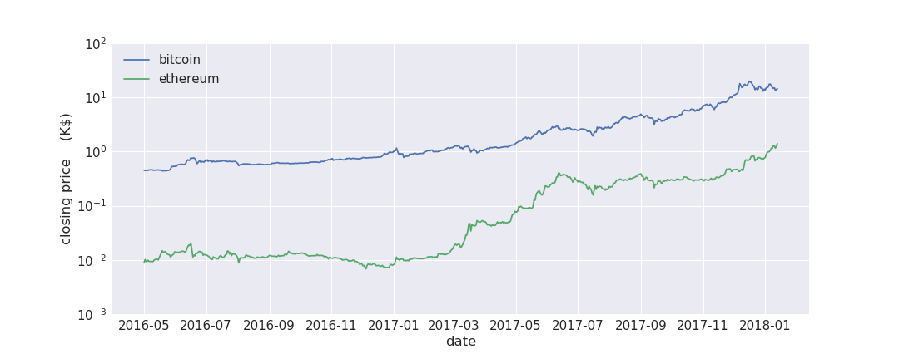
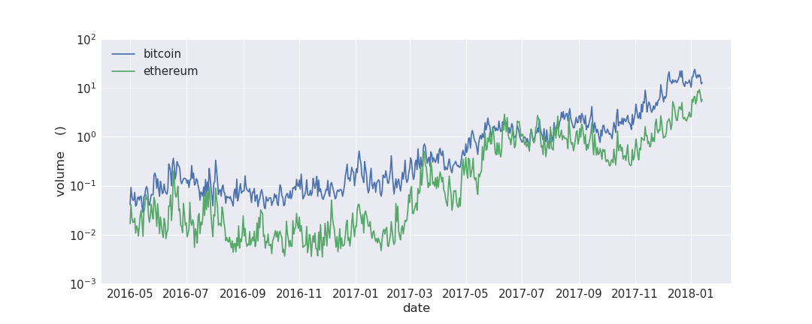

# cryptocoin-tensorflow-demo

by Joe Hahn, 
jmh.datasciences@gmail.com, 
21 January 2018 
git branch=master

### Abstract:

This simple demo illustrates the use of LSTM neural network to predict daily changes in the
Ethereum cryptocurrency. Source code is a Jupyter notebook that uses Keras on Tensorflow
to build a simple LSTM neural network to predict daily changes in Ethereum. This model is
trained on a very narrow dataset, namely the daily values and volumes of Bitcoin and Ethereum.
The following implicitly assumes that Bitcoin movements are driving the Ethereum valuations,
which is at best partly true but not sufficient for building an adequate predictive model
for Ethereum. But the principal goal here is to build a simple and test a LSTM model on
top of a simple dataset, and that at least is achieved.

### Setup:

1 I use the following to download conda to install Anaconda python plus the additional libraries
needed to execute this demo on my Mac laptop:

    wget https://repo.continuum.io/miniconda/Miniconda2-latest-MacOSX-x86_64.sh
    chmod +x ./Miniconda2-latest-MacOSX-x86_64.sh
    ./Miniconda2-latest-MacOSX-x86_64.sh -b -p ~/miniconda2
    #~/miniconda2/bin/conda install -y matplotlib
    ~/miniconda2/bin/conda install -y seaborn
    ~/miniconda2/bin/conda install -y jupyter
    ~/miniconda2/bin/conda install -y lxml
    ~/miniconda2/bin/conda install -y BeautifulSoup4
    ~/miniconda2/bin/conda install -y keras

2 Start Jupyter via

    ~/miniconda2/bin/jupyter notebook

and execute the ethereum-LSTM-model.ipynb notebook

### Execute

The notebook downloads two years of bitcoin and ethereum prices

and volumes

### Next steps:

1 figure out how to execute the above much more swiftly using my maptop's GPU

2 migrate this demo to an AWS instance having bigger faster GPU

