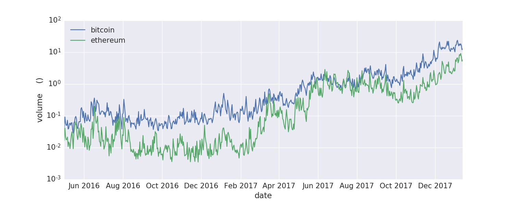
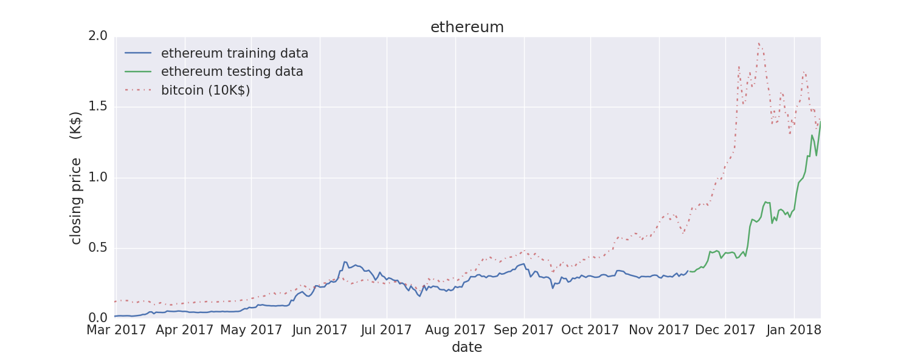

# cryptocoin-tensorflow-demo

by Joe Hahn 
jmh.datasciences@gmail.com 
22 January 2018 
git branch=gpu-on-bitfusion 

### Summary:

This demo trains an LSTM neural network to predict daily changes in the
Ethereum cryptocurrency. Source code is a Jupyter notebook that uses Keras on Tensorflow
to build a simple LSTM neural network to predict daily changes in Ethereum. This model is
trained on a very narrow dataset, namely the daily values and volumes of Bitcoin and Ethereum.
The following implicitly assumes that Bitcoin movements are driving the Ethereum valuations,
which is at best partly true and certainly not sufficient for building an adequate predictive model
for Ethereum. But the principal goal here is to build and test an LSTM model using
a simple dataset, and that at least is achieved.

A secondary goal was to execute this demo on a GPU in the AWS cloud.

### Setup:

1 launch a g2.2xl EC2 instance in the AWS cloud using these settings:

    EC2 > launch instance > Community AMIs
    search for 'Bitfusion Ubuntu TensorFlow' > g2.2xlarge ($0.76/hr)
    set tag Name=tf-demo
    security group settings:
        set SSH and TCP entries to have Source=My IP (this enables ssh and jupyter)
        add custom TCP rule, port=6006, Source=My IP (to enable tensorboard)
    create & download keypair named tf-demo.pem
    Launch

2 store private ssh key tf-demo.pem in subfolder 'private' with these permissions:

    chmod 400 private/tf-demo.pem

3 obtain the instance's public IP address from the EC2 console, and then ssh into the instance:

    ssh -i private/tf-demo.pem ubuntu@ec2-54-245-199-248.us-west-2.compute.amazonaws.com

4 clone this repo and select desired branch:

    git clone https://github.com/joehahn/cryptocoin-tensorflow-demo.git
    cd cryptocoin-tensorflow-demo
    git checkout gpu-on-bitfusion

5 install additional python libraries

    sudo pip install seaborn
    sudo pip install lxml
    sudo pip install --upgrade pandas          #use install --upgrade to resolve version conflicts
    sudo pip install --upgrade BeautifulSoup4

6 update locate database:

    sudo updatedb

7 get instance ID:

    ec2metadata --instance-id

8 start jupyter:

    jupyter notebook

9 browse jupyter at public_IP:8888 and log in with password=instance-id

    ec2-54-245-199-248.us-west-2.compute.amazonaws.com:8888

10 use Jupyter UI to upload predict_crypto_price.ipynb from this repo on your desktop,
and then Run it

11 monitor GPU usage via:

    watch -n0.1 nvidia-smi

Note that GPU utilization is only about 15%, and that the notebook's 1 minute execution 
time was comparable to that obtained on a CPU, sigh...

12 The LSTM model used here was cribbed from David Sheehan's blog post
https://dashee87.github.io/deep%20learning/python/predicting-cryptocurrency-prices-with-deep-learning,
which is worth a read.

### Execute

The notebook downloads two years of bitcoin and ethereum prices:

and plots currency prices

and volumes versus time:

An LSTM (Long Short Term Memory) model will be trained on data 
accrued prior to 2017-11-15 (blue curve, below)
and that model will then be used to predict the next-day change in ethereum's price
during subsequent days (green curve)

To help the model predict ethereum's next-day price change, the model is trained
on 4 days of lagged price and volume data. The notebook then builds a simple
LSTM  neural network using Keras on top of Tensorflow;
this network has 3 hidden layers that are all 12 neurons wide,
and training requires about 1 minute using the GPU on a g2.2xlarge instance in AWS. 

The MAE (mean absolute error) loss function is used to train the LSTM model,
and the model's MAE versus training epoch is shown below

This model is trained to predict ethereum's _fractional_ next-day price, so this figure
tells us that the trained LSTM model can predict
ethereum's next-day price with a 5% accuracy.

The trained LSTM model is then applied to
the test dataset, to predict ethereum's next-day fractional price
change for all dates after 2017-11-15. Green curve (below)
shows the actual next-day price variation versus date,
while the blue curve shows the predicted price change. Although the model predictions are
in the desired neighborhood, those predictions do not recover ethereum's
actual next-day price variation with enough accuracy to want to invest.
Also this model's predictions on the test dataset also have MAE = 5% (same as earlier),
so there appears to be no sign of under/over fitting.

Lastly, the red curve in the above plot shows predictions made by a simple linear regression (LR)
that was also trained on this data; that curve shows that the LR model is only somewhat useful across
the first month of testing data, with the LR model then veering away from reality at later times.
The LR model's MAE was also twice that of the LSTM model, so LSTM was two times more accurate than the
simplest of all machine-learning algorithms, and the LSTM predictions were much better behaved
further into the future.

### Conclusions

The above illustrates how to fit a simple LSTM neural network, using Keras on top of Tensorflow
plus a modest amount of cryptocurrency data, executing inside a Jupyter notebook, see 
https://github.com/joehahn/cryptocoin-tensorflow-demo/blob/gpu-on-bitfusion/predict_crypto_price.ipynb
for additional details

Note also that the execution of this notebook didn't benefit from any GPU acceleration,
run times were similar when executing on GPU and CPU. Presumably this is a consequence
of the dataset's very modest size and the small size of the neural network used here.

### Next steps:

1 broaden the dataset used here to include other market data (easy) plus 
market & cryptocurrency news (challenging)

###Notes

1 execute python2 script at commandline:

    python2 ./predict_crypto_price.py

