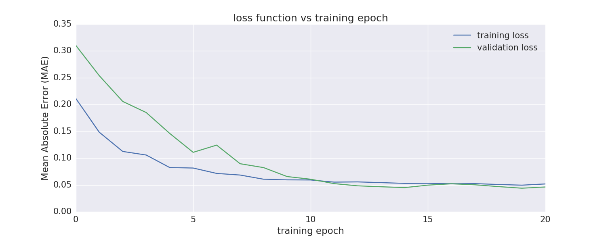

# cryptocoin-tensorflow-demo

by Joe Hahn 
jmh.datasciences@gmail.com 
21 January 2018 
git branch=master

### Summary:

This demo trains an LSTM neural network to predict daily changes in the
Ethereum cryptocurrency. Source code is a Jupyter notebook that uses Keras on Tensorflow
to build a simple LSTM neural network to predict daily changes in Ethereum. This model is
trained on a very narrow dataset, namely the daily values and volumes of Bitcoin and Ethereum.
The following implicitly assumes that Bitcoin movements are driving the Ethereum valuations,
which is at best partly true and certainly not sufficient for building an adequate predictive model
for Ethereum. But the principal goal here is to build and test an LSTM model using
a simple dataset, and that at least is achieved.

### Setup:

1 i use the following to download conda to install Anaconda python plus the additional libraries
needed to execute this demo on my Mac laptop:

    wget https://repo.continuum.io/miniconda/Miniconda2-latest-MacOSX-x86_64.sh
    chmod +x ./Miniconda2-latest-MacOSX-x86_64.sh
    ./Miniconda2-latest-MacOSX-x86_64.sh -b -p ~/miniconda2
    ~/miniconda2/bin/conda install -y seaborn
    ~/miniconda2/bin/conda install -y scikit-learn
    ~/miniconda2/bin/conda install -y jupyter
    ~/miniconda2/bin/conda install -y lxml
    ~/miniconda2/bin/conda install -y BeautifulSoup4
    ~/miniconda2/bin/conda install -y keras

2 Start Jupyter via

    ~/miniconda2/bin/jupyter notebook

and then execute the predict_crypto_price.ipynb notebook

3 Note that the LSTM model used here was cribbed from David Sheehan's blog post
https://dashee87.github.io/deep%20learning/python/predicting-cryptocurrency-prices-with-deep-learning,
which is worth a read.

### Execute

The notebook downloads two years of bitcoin and ethereum prices:

and plots currency prices

and volumes versus time:

An LSTM (Long Short Term Memory) model will be trained on data 
accrued prior to 2017-11-15 (blue curve, below)
and that model will then be used to predict the next-day change in ethereum's price
during subsequent days (green curve)

To help the model predict ethereum's next-day price change, the model is trained
on 4 days of lagged price and volume data. The notebook then builds a simple
LSTM  neural network using Keras on top of Tensorflow;
this network has 4 hidden layers that are all 16 neurons wide,
and training executes in 8 minutes using a Mac laptop's CPU. (Migrating this effort to use
the laptop's GPU to speed up the training time would be the next logical step.)

The MAE (mean absolute error) loss function is used to train the LSTM model,
and the model's MAE versus training epoch is shown below

This model is trained to predict ethereum's _fractional_ next-day price, so this figure
is purportedly telling us that the trained LSTM model can predict
ethereum's next-day price with a 2% accuracy, but see below.

The trained LSTM model is then applied to
the test dataset, to predict ethereum's next-day fractional price
change for all dates after 2017-11-15. Green curve (below)
shows the actual next-day price variation versus date,
while the blue curve shows the predicted price change. Although the model predictions are
in the desired neighborhood, those predictions do not recover ethereum's
actual next-day price variation with enough accuracy to want to invest.
Also this model's predictions have MAE = 5%,
which is considerably larger than that obtained on the training data, which tells
us that this LSTM model is suffering from some degree of overfitting, so additional detective
work is still needed to fix that.

Lastly, the red curve in the above plot shows predictions made by a simple linear regression (LR)
that was also trained on this data; that curve shows that the LR model is only somewhat useful across
the first month of testing data, with the LR model then veering away from reality at later times.
The LR model's MAE was also twice that of the LSTM model, so LSTM was two times more accurate than the
simplest of all machine-learning algorithms, and the LSTM predictions were much better behaved
further into the future.

### Conclusions

The above illustrates how to fit a simple LSTM neural network, using Keras on top of Tensorflow
plus a modest amount of cryptocurrency data, executing inside a Jupyter notebook, see 
https://github.com/joehahn/cryptocoin-tensorflow-demo/blob/master/predict_crypto_price.ipynb
for additional details

### Next steps:

1 adapt this demo so that it executes much more swiftly using laptop's GPU

2 migrate this demo to an AWS instance having bigger faster GPU

3 resolve the overfitting issue

4 broaden the dataset used here to include other market data (easy) plus 
market & cryptocurrency news (challenging)

